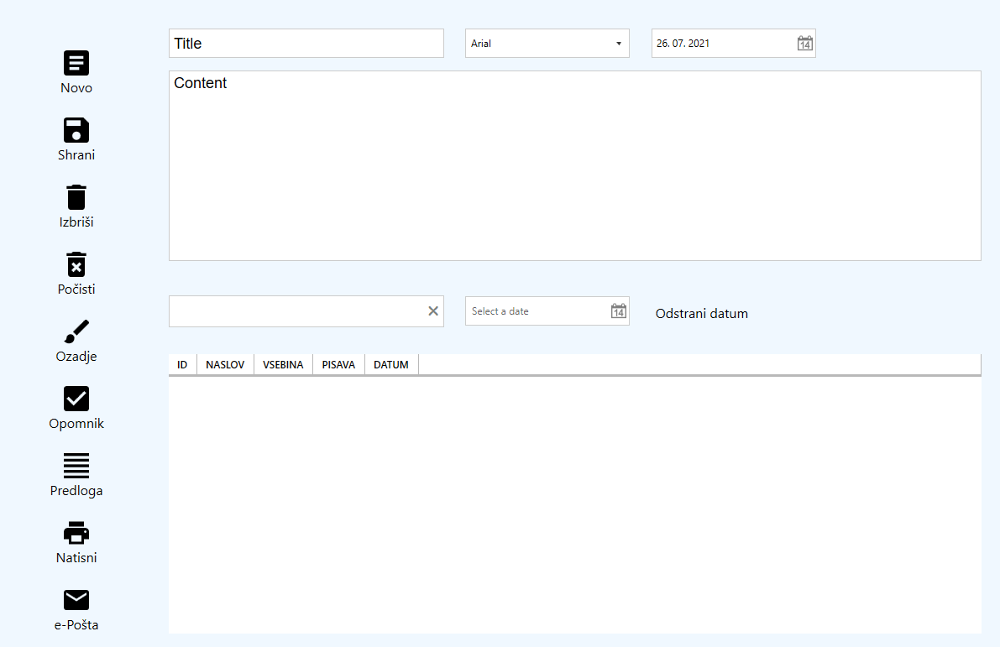
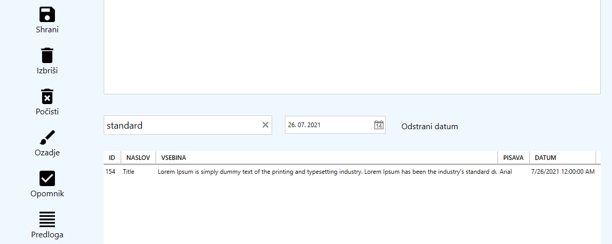
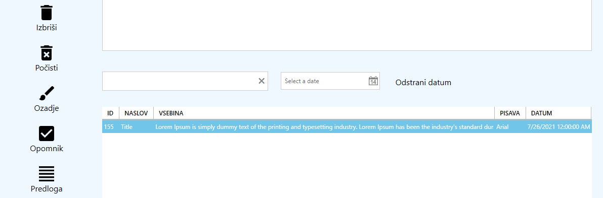
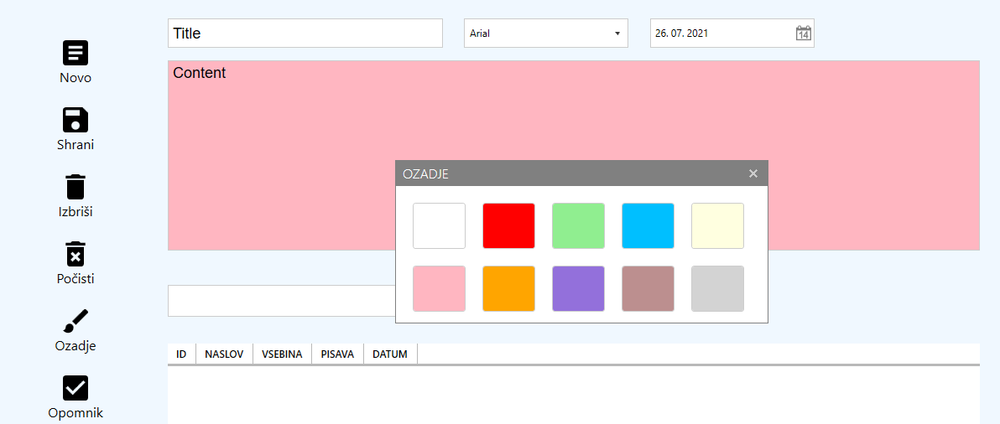
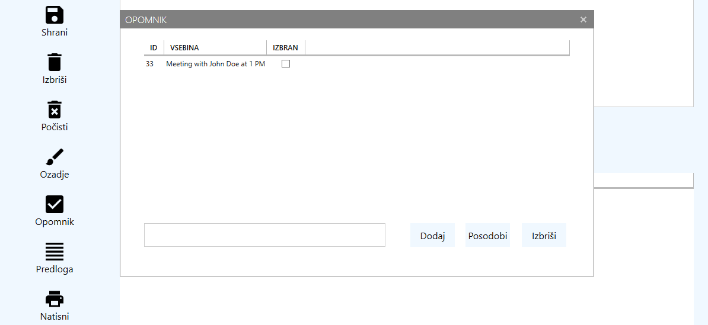
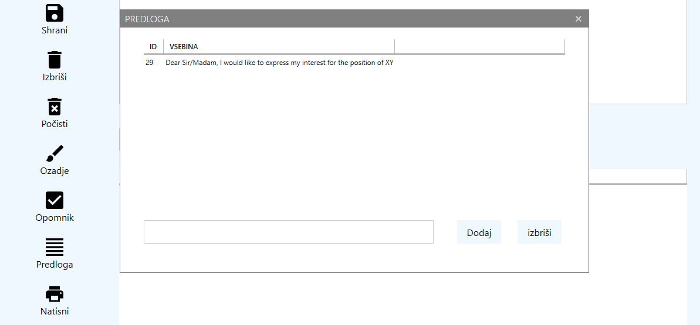
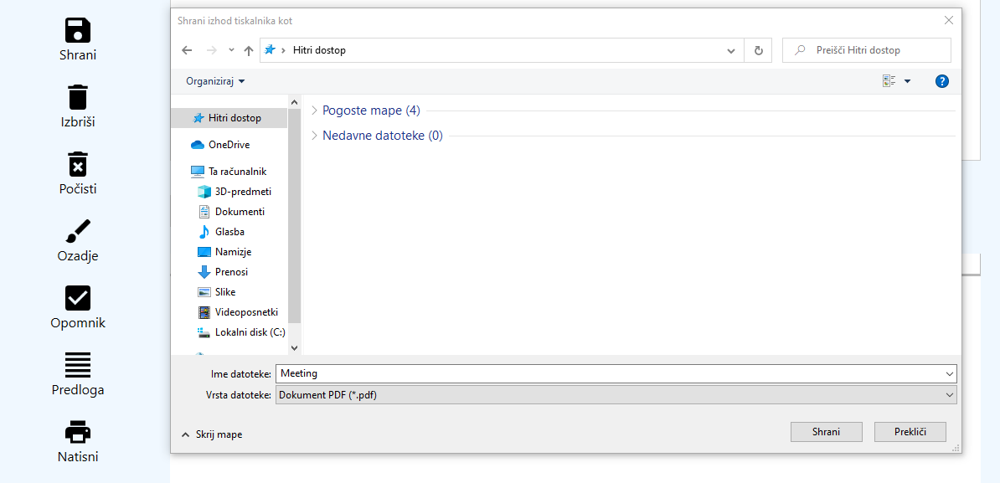
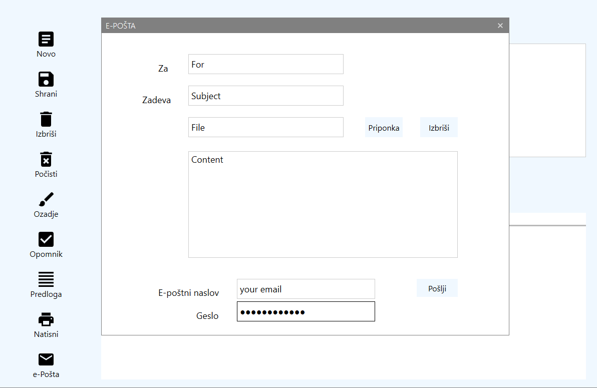
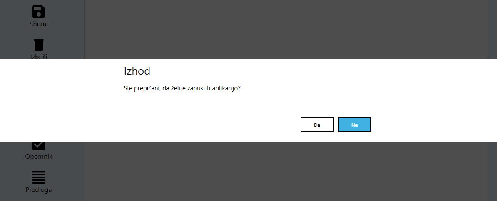

# WPF Note App

The app allows to create notes and save them in NoSQL database.

## Installation

#### Steps to install

<a href="https://www.geeksforgeeks.org/how-to-install-and-setup-visual-studio-for-c-sharp/">How to install and setup Visual Studio?</a>

The article describes nine steps but for using this app installation contains five steps from first to fifth, so after last step click Zapisnik.sln and then Start button.

## Screenshots

### Create

The app allows you to create notes, so you can type a title and a content. You can also set a font and a date.

### Save

Shrani is made for saving notes. They will be shown in content box below. In case of double-click on saved note, the content will be displayed into textarea for 
further text input. You can search the content by word or date. Odstrani datum will be deleted the search date. Novo is made for creating new note.

### Delete

First you have to click on saved note. It will be deleted when you click on Izbriši. Počisiti will be deleted all saved notes without  clicking on each one separately.

### Background

Change the background of textarea to different color.

### Task

You can add tasks with Dodaj, clear the content in textbox with Posodobi, Izbriši will be deleted the task but first you have to click the checkbox.

### Template

Add content with Dodaj, delete it with Izbriši but first you have to click on typed content. When you double-click on typed content, it will 
be shown into textare for further text input.

### Print

Print a note with Natisni. In case of unconnected printer will be shown pop-up window. Save a note to PDF file.

### E-mail

Choose a file with Priponka, you can also delete it with Izbriši. 
Send email with Pošlji included with your e-mail address and password of webmail service.

### Close

Close the app with Da, with Ne the app stays open.

See code <a href="https://github.com/veronikagregorec/note-app/tree/main/Zapisnik" target="_blank">here</a>

[Back to the top](#wpf-note-app)
